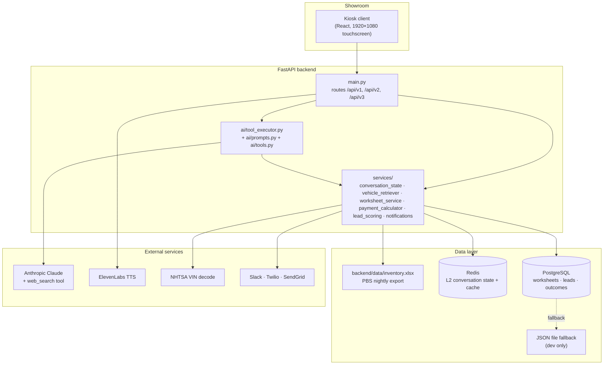

# Architecture

The NH Chevy Showroom Kiosk is a touchscreen sales assistant that lives on a New
Hampshire Chevrolet dealership's showroom floor. Customers chat with an AI grounded in
real inventory, build itemized deal worksheets, and get connected to staff via
Slack/SMS/email — all while standing in front of the screen. The central design
principle: **the customer is already in the showroom**, so every UX and behavioral
decision differs from a website chatbot. The system is a FastAPI backend, a React
touchscreen frontend, and a small ML service, talking to Anthropic Claude for
conversation and to PBS-format inventory data for ground truth.

## System diagram

## A request, end-to-end

A customer types `show me a blue Equinox under $35k` into the kiosk's `AIAssistant`
component. The frontend POSTs to `/api/v3/ai/chat` (registered in
`backend/app/main.py`). The handler asks `ConversationStateManager`
(`backend/app/services/conversation_state.py`) for the session's state; on a new session
it allocates one in the in-memory L1 dict and asynchronously persists a snapshot to
Redis as L2. The handler then assembles the system prompt from
`backend/app/ai/prompts.py`, attaches the eleven tool definitions from
`backend/app/ai/tools.py`, and invokes Anthropic Claude.

Claude returns a `tool_use` block calling `search_inventory({"query": "Equinox",
"color": "blue", "max_price": 35000})`. The handler dispatches through
`backend/app/ai/tool_executor.py`, which delegates to `SemanticVehicleRetriever` in
`backend/app/services/vehicle_retriever.py`. The retriever uses a hand-rolled
`TFIDFVectorizer` (no external ML dependency for retrieval) that was fit on inventory
text at startup, when `backend/app/routers/inventory.py` loaded
`backend/data/inventory.xlsx` via pandas. Cosine scoring across the ~200-vehicle corpus
returns ranked matches in single-digit milliseconds; the budget filter and color match
are applied as cheap post-filters.

The tool result is serialized as JSON and returned to Claude, which uses it to write a
natural-language response naming two or three specific stock numbers. The conversation
manager persists the updated turn to L1 and writes-through to Redis. The frontend
renders the response into the chat surface, along with vehicle cards built from the
structured tool result. Total wall-clock budget for the round trip is dominated by the
Claude API call; everything else (state load, retrieval, persistence) runs in tens of
milliseconds.

## Design decisions

The choices below are the ones that meaningfully shaped the codebase. Each is
captured in long form as an Architecture Decision Record under
[`docs/adr/`](docs/adr/); the summaries here are the headline.

### Excel as the inventory source of truth, not a sync API
We chose to read PBS's nightly XLSX export over integrating the PBS REST API or
contracting with a third-party feed (HomeNet, vAuto). PBS API access is gated behind
dealer-group contracts and per-rooftop provisioning; XLSX exports are how the dealership
already feeds its website provider. `backend/app/routers/inventory.py` reads
`backend/data/inventory.xlsx` at startup via `pandas.read_excel`, and the kiosk is
read-only on inventory — it never writes back to PBS. This eliminates the failure mode
where a kiosk bug corrupts the live inventory database, and it means the kiosk works on
day one for any PBS-using rooftop.

### TF-IDF semantic retrieval, not vector embeddings
We chose hand-rolled TF-IDF over an embeddings API (OpenAI `text-embedding-3-small` or
similar). At ~200 vehicles per rooftop, brute-force cosine over a sparse TF-IDF corpus
runs in single-digit milliseconds with no external dependency; an embeddings call adds
100–300 ms of API latency and a per-query cost. Quality at this scale is dominated by
token overlap — the word "Silverado" in the query matches "Silverado" in the corpus, and
no embedding model adds meaningful signal on top. `SemanticVehicleRetriever` in
`backend/app/services/vehicle_retriever.py` defines its own `TFIDFVectorizer` class so
retrieval has no scikit-learn dependency at all.

### Tool use over RAG
We chose Claude tool use over retrieval-augmented generation. Eleven tools
(`search_inventory`, `get_vehicle_details`, `find_similar_vehicles`, `calculate_budget`,
`check_vehicle_affordability`, `create_worksheet`, `notify_staff`, `mark_favorite`,
`lookup_conversation`, `save_customer_phone`, plus Anthropic's built-in `web_search`)
are defined in `backend/app/ai/tools.py` and dispatched via
`backend/app/ai/tool_executor.py`. Tools let the model ask precise questions ("blue
Equinoxes under 35k") rather than reasoning over a 200-row table stuffed into context,
and — unlike RAG, which is read-only by design — tools also let the AI take actions like
paging staff or generating a worksheet when the conversation reaches that point.

### Hybrid conversation state: in-memory + Redis, separate from Postgres durables
We chose to split state by access pattern. `ConversationStateManager`
(`backend/app/services/conversation_state.py`) keeps live conversation state in a
per-process Python dict (L1) with write-through to Redis (L2) for cross-pod sharing.
Worksheets, leads, and conversation outcomes are durable business artifacts and go to
Postgres via SQLAlchemy. Conversation state churns every turn and is worthless after the
session ends; worksheets and leads need to be queryable by the sales-manager dashboard
for days afterward. One storage tier for both would compromise both.

### Anthropic Claude over OpenAI/Gemini
We chose Anthropic Claude (default `claude-sonnet-4-5`) primarily for tool-use
reliability across multi-tool conversations — Claude composes 2–4 tool calls per turn
cleanly without prompting acrobatics, which matters because chains like
`search_inventory` → `get_vehicle_details` → `calculate_budget` are routine. The
system-prompt voice in `backend/app/ai/prompts.py` (the customer "is standing in front
of you RIGHT NOW") is honored consistently across long conversations. The tradeoff is
single-vendor dependency; the fallback path in `backend/app/ai/helpers.py` returns a
deterministic response if the upstream is unavailable, and all Claude calls go through
one module so swapping vendors is a single-module change.

### JSON file fallback alongside Postgres
We chose to ship a JSON file fallback that activates when `DATABASE_URL` is unset.
`backend/app/database.py` checks for the env var at runtime and routes to file-based
storage if it's missing, logging a warning. This is explicitly a development affordance
— the kiosk demos on a fresh laptop without a Postgres install — and is not a supported
production posture. Production deployments must configure `DATABASE_URL`; the warning
log is the seam that makes the misconfiguration visible.

## Where to look next

- [`docs/ARCHITECTURE.md`](docs/ARCHITECTURE.md) — the deep architectural reference (request flows, service-by-service responsibilities, state machines)
- [`docs/INDUSTRY_CONTEXT.md`](docs/INDUSTRY_CONTEXT.md) — dealership domain context: PBS, four-square, F&I, BDC, lead lifecycle vocabulary
- [`docs/adr/`](docs/adr/) — Architecture Decision Records for the choices above, in long form
