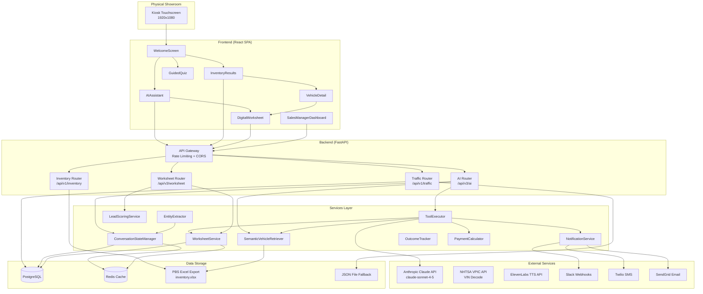

# Quirk AI Kiosk -- System Architecture

## System Overview

The Quirk AI Kiosk is a physical showroom kiosk that helps customers browse inventory, chat with an AI sales assistant, build deal worksheets, and connect with sales staff. The customer is already in-store -- the AI acts as an in-person salesperson.

### High-Level System Diagram



---

## Data Flow: Key User Journeys

### 1. AI Chat Conversation

```
Customer types message
    |
    v
AIAssistant.tsx --> api.chatWithAI() or api.chatWithAIStream()
    |
    v
POST /api/v3/ai/chat (or /chat/stream for SSE)
    |
    v
ai_v3.py:
  1. Get/create ConversationState for session_id
  2. Extract budget from message (regex patterns)
  3. Build dynamic system prompt with:
     - Conversation context (stage, preferences, trade-in)
     - Inventory context (models available, price ranges)
  4. Call Anthropic Claude API with tools
    |
    v
Claude responds (may invoke tools):
  - search_inventory --> SemanticVehicleRetriever.search()
  - calculate_budget --> BudgetCalculator
  - get_vehicle_details --> VehicleRetriever.get_by_stock()
  - notify_staff --> NotificationService
  - create_worksheet --> WorksheetService
  - mark_favorite --> ConversationStateManager
  - save_customer_phone --> ConversationStateManager
  - lookup_conversation --> ConversationStateManager
  - check_vehicle_affordability --> BudgetCalculator
  - find_similar_vehicles --> VehicleRetriever
    |
    v
Tool results fed back to Claude for final response
    |
    v
ConversationState updated (stage, interest, entities)
    |
    v
Response returned with message + vehicles + metadata
```

### 2. Vehicle Search (Inventory Browse)

```
Customer selects category/model/budget on kiosk
    |
    v
InventoryResults.tsx --> api.getInventory(filters)
    |
    v
GET /api/v1/inventory?body_style=Truck&max_price=60000
    |
    v
inventory.py:
  1. Filter in-memory INVENTORY list (loaded from Excel at startup)
  2. Apply all query parameter filters
  3. Sort by price descending
  4. Generate featured subset (one per model family)
    |
    v
Return { vehicles: [...], total: N, featured: [...] }
    |
    v
Customer clicks a vehicle --> VehicleDetail.tsx
    |
    v
GET /api/v1/inventory/{vehicle_id}
```

### 3. Digital Worksheet Creation

```
Customer (via AI chat or VehicleDetail "Build Deal" button)
    |
    v
POST /api/v3/worksheet/create
  { session_id, stock_number, customer_name, down_payment, ... }
    |
    v
WorksheetService.create_worksheet():
  1. Look up vehicle from inventory by stock number
  2. Get ConversationState for session (budget, trade-in info)
  3. Calculate payment options for 60/72/84 month terms
  4. Compute lead score based on engagement signals
  5. Create Worksheet object, store in memory (+ Redis)
    |
    v
DigitalWorksheet.tsx renders:
  - Vehicle details and pricing
  - Three term options (60/72/84 months)
  - Down payment and trade-in adjustable sliders
  - "I'm Ready" button
    |
    v
Customer adjusts terms --> PATCH /api/v3/worksheet/{id}
  - Recalculates payments
  - Updates lead score
    |
    v
Customer clicks "I'm Ready" --> POST /api/v3/worksheet/{id}/ready
  1. Status changes to READY
  2. Lead score boosted
  3. Staff notified via Slack/SMS/Email
  4. WebSocket broadcast to SalesManagerDashboard
    |
    v
Manager sees hot lead on dashboard
  - POST /api/v3/worksheet/manager/{id}/review
  - PATCH /api/v3/worksheet/manager/{id} (adjust pricing)
  - POST /api/v3/worksheet/manager/{id}/counter-offer
  - POST /api/v3/worksheet/manager/{id}/accept
```

### 4. Staff Notification Dispatch

```
Trigger: AI tool "notify_staff" or Worksheet "I'm Ready"
    |
    v
NotificationService.notify_staff(type, message, session_id, vehicle_stock)
    |
    +---> Slack: POST to team-specific webhook
    |       (SLACK_WEBHOOK_SALES, SLACK_WEBHOOK_APPRAISAL, etc.)
    |       Sends formatted message with customer info, vehicle, budget
    |
    +---> SMS: Twilio API
    |       (SMS_NOTIFY_SALES, SMS_NOTIFY_APPRAISAL phone numbers)
    |       Compact message with key details
    |
    +---> Email: SendGrid API
            (EMAIL_NOTIFY_SALES, EMAIL_NOTIFY_APPRAISAL addresses)
            HTML formatted notification
    |
    v
Returns { slack_sent, sms_sent, email_sent, errors }
```

---

## Service Layer Overview

### Core Services

| Service | File | Responsibility |
|---------|------|----------------|
| **ConversationStateManager** | `app/services/conversation_state.py` | Maintains persistent state across chat turns. Tracks entities (budget, trade-in, preferences), conversation stage (greeting through handoff), interest level, discussed vehicles, and objections. Uses in-memory dict as L1 cache with Redis as L2. |
| **SemanticVehicleRetriever** | `app/services/vehicle_retriever.py` | TF-IDF based semantic search over inventory. Fits on vehicle text at startup. Supports natural language queries ("blue truck for towing"), preference-weighted scoring, and conversation-context-aware results. |
| **WorksheetService** | `app/services/worksheet_service.py` | Creates and manages Digital Worksheets for deal structuring. Calculates payment options across terms, manages worksheet lifecycle (DRAFT -> READY -> NEGOTIATING -> ACCEPTED), and coordinates with notification service. |
| **NotificationService** | `app/services/notifications.py` | Sends real-time notifications to staff via Slack webhooks, Twilio SMS, and SendGrid email. Routes to team-specific channels based on notification type (sales, appraisal, finance). |
| **ToolExecutor** | `app/ai/tool_executor.py` | Executes AI tools when Claude decides to use them. Maps tool names to handler functions, processes results, and tracks which tools were used. |
| **PaymentCalculator** | `app/services/payment_calculator.py` | Calculates monthly payments, total interest, and affordability for finance and lease scenarios. Used by both the budget tool and worksheet service. |
| **LeadScoringService** | `app/services/lead_scoring.py` | Scores leads on a 0-100 scale based on engagement signals (messages sent, vehicles viewed, budget shared, trade-in discussed, worksheet created). Tiers: HOT (70+), WARM (40-69), COLD (0-39). |
| **EntityExtractor** | `app/services/entity_extraction.py` | Extracts structured entities from free-text messages: names, phone numbers, budget amounts, vehicle preferences, trade-in details. Updates ConversationState with extracted data. |
| **OutcomeTracker** | `app/services/outcome_tracker.py` | Records conversation outcomes (lead captured, test drive scheduled, deal closed, walked away) for analytics and AI improvement suggestions. |

### AI Module

| File | Purpose |
|------|---------|
| `app/ai/tools.py` | Tool definitions (JSON schema) for Claude's tool use: `calculate_budget`, `search_inventory`, `get_vehicle_details`, `find_similar_vehicles`, `notify_staff`, `mark_favorite`, `save_customer_phone`, `lookup_conversation`, `create_worksheet`, `check_vehicle_affordability`, plus Anthropic's built-in `web_search`. |
| `app/ai/prompts.py` | System prompt template. Formats with dynamic conversation context and inventory context. Defines the AI's persona as Quirk Chevrolet's in-store assistant. |
| `app/ai/helpers.py` | Helper functions: builds dynamic context from ConversationState, formats inventory summaries, formats vehicle data for tool results, generates fallback responses when Claude is unavailable. |
| `app/ai/tool_executor.py` | Dispatches tool calls to appropriate handler functions. Each tool returns (result_text, vehicles_list, staff_notified). |

---

## State Management

### Conversation State Lifecycle

```
[New Session]
    |
    v
  GREETING -----> DISCOVERY -----> BROWSING
    |                |                |
    |                v                v
    |            TRADE_IN        COMPARING
    |                |                |
    |                v                v
    |            FINANCING       DEEP_DIVE
    |                |                |
    |                +-------+--------+
    |                        |
    |                        v
    |                    OBJECTION
    |                        |
    |                        v
    |                   COMMITMENT
    |                        |
    |                        v
    +----->             HANDOFF
```

**Stage transitions** are detected automatically based on conversation content:
- Budget mentions -> DISCOVERY or FINANCING
- Vehicle searches -> BROWSING
- Specific vehicle questions -> DEEP_DIVE
- Trade-in mentions -> TRADE_IN
- "I'm ready" / "let's do it" -> COMMITMENT
- Staff notification sent -> HANDOFF

**Interest Level** tracks engagement temperature:
- **COLD**: Just browsing, no specific interest
- **WARM**: Asking about specific vehicles or pricing
- **HOT**: Discussing financing, trade-in, or ready to deal
- **COOLING**: Was interested but raising objections

### Worksheet Lifecycle

```
[AI creates worksheet] or [Customer clicks "Build Deal"]
    |
    v
  DRAFT -----> READY -----> MANAGER_REVIEW
    |             |               |
    |             |               v
    |             |          NEGOTIATING <---+
    |             |               |          |
    |             |               v          |
    |             |          [counter-offer]-+
    |             |               |
    |             +-------+-------+
    |                     |
    |                     v
    |                 ACCEPTED
    |
    +--> EXPIRED (24h timeout)
    +--> DECLINED (customer/manager)
```

**Lead Score** is a composite metric (0-100) that increases with:
- Messages exchanged (+2 per message, max +20)
- Vehicles discussed (+5 each)
- Budget shared (+10)
- Trade-in discussed (+10)
- Worksheet created (+15)
- "I'm Ready" clicked (+20)
- Customer phone/email provided (+10)

---

## Deployment Architecture

### Production (Railway)

```
                    Internet
                       |
                       v
              [Railway Platform]
                       |
          +------------+------------+
          |                         |
    [Frontend SPA]           [Backend API]
    Netlify/Vercel           Railway Service
    Static React Build       Python 3.11 + FastAPI
          |                         |
          |                  +------+------+
          |                  |             |
          |            [PostgreSQL]   [Redis]
          |            Railway DB    Railway Redis
          |                  |             |
          +--------+---------+------+------+
                   |                |
           [Anthropic API]  [External Services]
           Claude Sonnet    Slack, Twilio, SendGrid,
                            NHTSA, ElevenLabs
```

### Environment Variables

The backend is configured entirely through environment variables. Key groups:

| Group | Variables | Purpose |
|-------|-----------|---------|
| **Required** | `ANTHROPIC_API_KEY` | Claude AI access |
| **Environment** | `ENVIRONMENT`, `HOST`, `PORT` | Runtime config |
| **Auth** | `JWT_SECRET_KEY`, `ADMIN_API_KEY` | Security |
| **Database** | `DATABASE_URL` | PostgreSQL connection |
| **Cache** | `REDIS_URL` | Redis for state persistence |
| **Notifications** | `SLACK_WEBHOOK_*`, `TWILIO_*`, `SMS_NOTIFY_*`, `SENDGRID_API_KEY`, `EMAIL_*` | Staff alerts |
| **TTS** | `ELEVENLABS_API_KEY`, `ELEVENLABS_VOICE_ID` | Voice synthesis |
| **Monitoring** | `SENTRY_DSN`, `LOG_LEVEL` | Error tracking |

See `backend/.env.example` for the complete list with descriptions.

### Database

**PostgreSQL** is the primary database. Tables:

| Table | Purpose |
|-------|---------|
| `traffic_sessions` | Kiosk session data for Sales Manager Dashboard |
| `worksheets` | Digital Worksheet records |
| `conversation_states` | Persistent AI conversation state |

When `DATABASE_URL` is not configured, the system falls back to JSON file storage (`backend/data/`) for traffic sessions and in-memory storage for conversation state and worksheets.

### Redis

Used as an L2 cache layer for:
- Conversation state (`conv:{session_id}`, 24h TTL)
- Phone-to-session mappings (`phone:{digits}`)
- Worksheets (`ws:{worksheet_id}`, 24h TTL)
- Session worksheet lists (`session_ws:{session_id}`)

Falls back to in-memory-only mode if Redis is unavailable. All writes are write-through (L1 in-memory + L2 Redis).

### Inventory Data

Vehicle inventory is loaded from a PBS DMS Excel export (`backend/data/inventory.xlsx`) at application startup. The data is held in memory and indexed by the SemanticVehicleRetriever for TF-IDF search. There is no runtime database for inventory -- it is refreshed on deploy.
